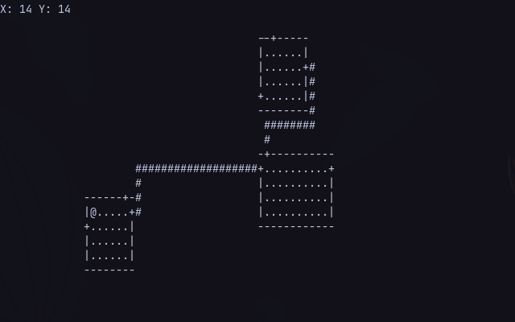

# Nocturnus
Inspited by the early versions of [libtcod](https://github.com/libtcod/libtcod), **Nocturnus** is a library designed for Terminal-based drawing and Terminal-based Roguelike development. Its focus is to provide a simple way to render graphics in the terminal, supporting Unix and Windows

In conjuction with this library, I am also developing a "plugin" for Terminal-based Roguelike development. Inspired by [Nethack](https://nethackwiki.com/wiki/Main_Page) and [Rogue](https://en.wikipedia.org/wiki/Rogue_(video_game)). This combination aims to provide a toolkit for Roguelike development



# Compiling
## Linux
You can compile to a static library to use on your own project by running the following command:
```sh
make
```

If you want to test the example in [`test/`](test/), you can run the following:
```sh
make dev
```

## Windows or To Windows
For compiling to windows, you need to specify what compiler you want to use. This is an example of compiling to Windows from Linux using **Mingw**
```sh
make win CXX=i686-w64-mingw32-g++
```

This will also create a static library for Windows


# Basic usage example
```cpp
#include <nocturnus/roguelike.hpp>

struct Player {
	Player(Terminal& terminal, const vec2<uint16>& pos);
	vec2<uint16> pos;

	inline void draw() {
		this->terminal.putchar(this->pos.x, this->pos.y, '@');
	}

	inline void move(const vec2<uint16>& newpos, const char footprint = '.') {
		this->terminal.putchar(this->pos.x, this->pos.y, footprint);
		this->pos = newpos;
		this->terminal.putchar(this->pos.x, this->pos.y, '@');
	}

	private:
		Terminal& terminal;
};

void setup_map(Roguelike& rogue) {
	rogue.make_room(13, 13, 6, 4);
	rogue.make_room(40, 10, 10, 4);
	rogue.make_room(40, 2, 6, 4);

	rogue.draw_rooms();
}

void update_term(Terminal& terminal) {
	// Create player
	Player player = Player(terminal, { 14, 14 });

	// Main loop
	char ch;
	while((ch = terminal.getkey()) != 'q') {
		vec2<uint16> newpos = player.pos;
		switch (ch) {
			case 'w':
				newpos.y -= 1;
				break;
			case 'a':
				newpos.x -= 1;
				break;
			case 's':
				newpos.y += 1;
				break;
			case 'd':
				newpos.x += 1;
				break;
		}

		// Collision
		switch (terminal.mvinch(newpos.x, newpos.y)) {
			// Walkable, move
			case '.':
			case '#':
			case '+':
				player.move(newpos);
				break;

			// Don't move if is not walkable
			default:
				break;
		}

		player.draw();
	}
}

int main() {
	// Setup
	Terminal terminal = Terminal();
	terminal.hide_cursor();
	terminal.disable_echoing();

	// Config roguelike class
	Roguelike rogue = Roguelike(&terminal);

	// terminal.waitkey(); // view compiling info

	// Init
	terminal.clear_screen();
	terminal.putstring(0, 0, "Press any key to start");

	// Draw
	setup_map(rogue);
	update_term(terminal);

	// exit
	terminal.show_cursor();
	terminal.disable_echoing(false);
}
```
